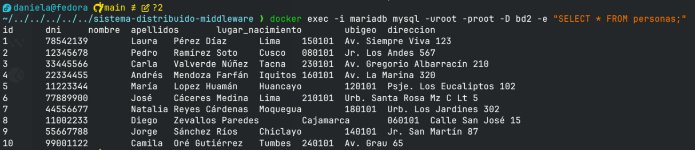

Para listar contenedores:

```zsh
docker ps -a
```


Para mostrar base de datos en mysql
```zsh
docker exec -i mariadb mysql -uroot -proot -e "SHOW DATABASES;"
```



Lo mismo para postgres

```zsh
docker exec -i postgres psql -U postgres -d bd1 -c "SELECT * FROM usuarios;"
```

```zsh
docker exec -i mariadb \
  mariadb -uroot -proot bd2 < sql/bd2_mariadb.sql
```

```zsh
docker exec -i postgres \                
  psql -U postgres -d bd1 < sql/bd1_postgres.sql
```